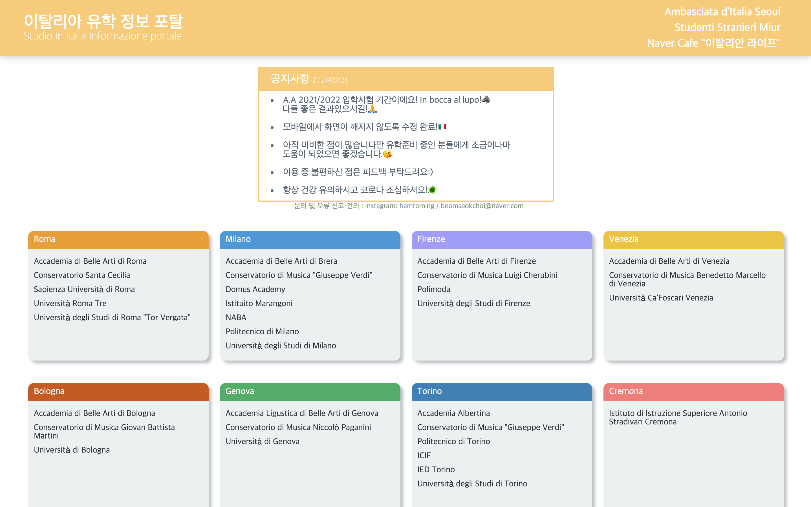

# 이탈리아 유학정보 포탈 (Info-study-italy)

http://info-study.italy.ml

## 개발 기간

2021년 6월 13일 - 2021년 7월 26일 

## 개발 언어

HTML, CSS

## 아이디어 

3년전 이탈리아 유학을 준비할때 대부분 이탈리아 학교들의 사이트들이 직관성이 그렇게 좋지 못했다.
간단한 입학 정보들을 찾는데도 사이트 구석구석을 헤메야했고 많은 시간이 들었다.
유학 준비생들이 정보에 쉽게 접근할 수 있도록 연결해주는 사이트를 만들면 좋겠다 싶었다.

## 어려웠던 점?

HTML 구조에서 고민이 좀 있었던 것 같다. 
현재 HTML 문서의 구조가 그렇게 좋지 못하다. 
기능하는 것에만 중점을 두고 짜다보니 보기 정말 안좋은 부분들이 많다.

그리고 디자인을 할때 좀처럼 방향을 잡을 수가 없었다.
나름 없는 감각을 쥐어짜봤는데
만들고보니 못생겨도 너무 못생겼다.
보기 좋은 사이트를 만드는게 코딩보다 더 어려운 것 같다.

## 배운 점?

HTML / CSS 정도만 가지고 만드는 간단한 프로젝트라 굉장히 쉽게 생각했었다.
그런데 중요한 것들을 많이 빼먹은 것 같다.
일단 Sementic HTML이 왜 필요한지 깨달았다.
div와 span으로 덕지덕지 점철된 내 html 문서를 보니 나도 이해하기가 힘들더라.
CSS도 마찬가지다. 어떻게 분할 정복할지 어떻게 class를 가독성이 좋게 만들지 제대로 아직 파악이 안되는 것 같다.
그냥 작동하는 것만이 중요한게 아니라 문서 자체에 좀 더 많은 신경을 써야할 것 같다.

## 느낀 점?

아이디어는 좋았지만 만들고 보니 결국 많은 사람들이 이용할 수 있는 서비스는 아니었다.
먼저 이탈리아 유학 준비생들은 이탈리아어가 당연히 약할 수 밖에 없다.
이탈리아어를 잘 모르면 정보에 접근을 해도 활용하기 어려울것이다. 
구글 번역기는 사실상 별 도움이 되지 않는다..
게다가 대부분 유학원을 통해서 준비하기 때문에 애초에 이런 정보를 직접 찾는 이들은 드물다.
그래도 네이버 카페에 고정글로 사이트가 올라가고 몇몇 분들에게 칭찬도 받고
자식 유학 준비에 유용할것 같다는 말도 듣고 되게 보람차고 뿌듯한 감정이 들더라.

